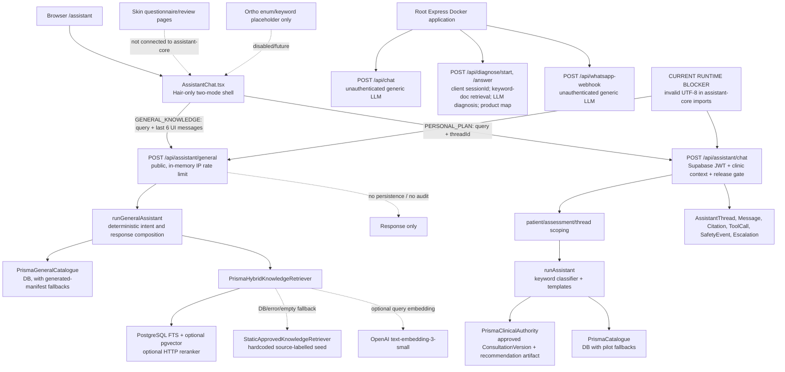

# Dr. FACT RAG chatbot current-state audit

Audit date: 2026-08-03  
Repository: `D:\Dr Fact Folder\RAG Chatbot`  
Branch: `feat/assessment-v3`  
Method: read-only source trace plus safe local verification. No application behaviour, production data, configuration, migration, deployment, commit, or remote state was changed.

## 1. Executive verdict

**Verdict: partially implemented RAG, currently broken at runtime. It is not a governed clinical assistant and is not production-ready.**

The repository contains materially more than a UI concept: there is a Hair-only assistant shell, structured catalogue tools, a governed knowledge schema, hybrid PostgreSQL retrieval, claim metadata, citations, personal-plan persistence, release gates, and a substantial unit/evaluation suite. However, the current Next.js production build and both assistant APIs fail because `src/packages/assistant-core/generalEngine.ts` and `pilotKnowledge.ts` contain invalid UTF-8. The working UI is therefore a static shell around non-working assistant endpoints. The newer answer path is also not an LLM chat system: it optionally calls OpenAI only for query embeddings, then returns deterministic templates or retrieved chunk text verbatim. Separately, the root Express application still exposes an older, unauthenticated generic “AI trichologist” chat and LLM-diagnosis/product-mapping stack that bypasses the newer controls.

**Overall completion: 32%.** This estimates progress toward the requested governed, clinically isolated, production-operable Dr. FACT assistant—not lines of code. Credit is given for the Hair data model, retrieval filters, exact-fact ports, safety scaffolding, release controls, persistence models, UI shell, and evaluations. No credit is given for Skin/Ortho assistant implementation, production runtime, complete safety policy, end-to-end authorization proof, operational observability, or a deployable governed response path.

Two critical findings and seven high findings block any clinical release. The two critical findings are the legacy unauthenticated LLM diagnosis/product recommendation endpoint and the legacy unauthenticated generic LLM/WhatsApp chat path.

## 2. Current architecture

This is the architecture that exists in source. Runtime verification showed the UI page itself returning 200, while all tested assistant POSTs returned 500 during module compilation. The root Express architecture is independently build/deployable via the root `Dockerfile`, although the root TypeScript build is currently failing and `src/app.ts` plus `src/server.ts` both call `listen`, creating an additional startup defect.

## 3. End-to-end runtime trace

| Entry route | User role | API route | Auth | Product routing | Retrieval | Model | Persistence | Citations | Status |
|---|---|---|---|---|---|---|---|---|---|
| `/assistant`, General knowledge | Anonymous | `POST /api/assistant/general` | No identity; process-local IP rate limit | Query-derived Hair/Skin/Ortho detection; no required `productCode`; unknown text defaults Hair | Intended PostgreSQL hybrid with global Hair-only filters; static approved fallback | Optional OpenAI embedding only; no completion model | None | Returned source list generated from claim rows/static seed | **Broken:** local requests return 500; production build cannot parse assistant modules |
| `/assistant`, My approved plan | Authenticated patient/internal role | `POST /api/assistant/chat` | Supabase `getClaims`, clinic required, release-mode gate | Hair-only keyword scope; no `productCode`/`concernCode` contract | No vector RAG for plan answers; approved consultation + deterministic trace and structured catalogue | No model call | Thread, user/assistant messages, tool calls, citations, safety event, escalation | Persisted, but every citation stores the entire answer as `claimText` | **Broken at import/runtime**; source path otherwise substantial |
| Thread history | Authenticated thread creator | `GET /api/assistant/threads/[threadId]` | JWT, release gate, clinic + `createdBy` | Thread carries no product/concern fields | None | None | Reads messages only | Citation rows are not returned | Source-complete; not used by current UI and runtime not independently verified |
| Feedback | Authenticated thread creator | `POST /api/assistant/feedback` | JWT, release gate, clinic + thread creator | None | None | None | Writes feedback | None | Source-complete; `messageId` is not proven to belong to the thread |
| Legacy web chat | Anonymous | Express `POST /api/chat` | None; permissive CORS | Hair-ish keyword orchestration, otherwise generic | None | Generic completion using `LLM_MODEL` | Only bot message when caller supplies a valid session | None | Unsafe legacy implementation; no production request executed to avoid an external model call |
| Legacy diagnosis | Anonymous caller with any session ID | Express `POST /api/diagnose/start` and `/answer` | None | Hair only, implicit | Local `.txt/.md/.json` keyword scan; 1,200-char chunks, 250-char overlap, top 5 | Completion instructed to act as “AI trichologist” and return diagnosis JSON | Mutates session and creates Diagnosis | None | Critical unsafe/IDOR path; no external call executed |
| Legacy WhatsApp | Anonymous webhook caller | Express `POST /api/whatsapp-webhook` | No signature verification | Hair keyword orchestration | None | Same generic AI-trichologist completion | Creates session/WhatsApp mapping | None | Critical unsafe path; can send outbound messages if credentials exist |

### Real request trace: General knowledge

`AssistantChat.submit` → JSON `{mode, query, history}` → public route → IP bucket → `understandQuestion` → query-derived domain/intent → structured catalogue and/or `PrismaHybridKnowledgeRetriever` → optional embedding → prefiltered SQL candidate search → optional reranker/heuristic → direct chunk concatenation → source array → JSON → plain paragraph and expandable Sources UI. There is no completion-model prompt construction, output schema validation, general-message persistence, request audit, token accounting, or claim-to-sentence citation validation. Current execution breaks while compiling `generalEngine.ts`.

### Real request trace: Personal plan

`AssistantChat.submit` → JSON `{mode, query, threadId}` (the UI does not send patient or assessment context) → verified JWT → release gate → clinic required → patient self-resolution or optional client-supplied patient/assessment scoping → thread ownership/immutability → user message write → keyword classifier/safety regex → approved consultation/artifact read or structured catalogue call → deterministic response → assistant message/citation/tool/safety/escalation writes → JSON → paragraph, sources and optional internal trace. Writes are not transactional and the route breaks at module import today.

## 4. Implementation inventory

| Capability | Status | Important files | Evidence | Notes |
|---|---|---|---|---|
| Assistant UI shell | Partial | `apps/patient-portal/src/app/assistant/page.tsx`; `components/assistant/AssistantChat.tsx` | Page returned HTTP 200; desktop screenshot captured | Hair-only, no history navigation, no structured-card renderer, no streaming |
| General Hair assistant route | Broken | `app/api/assistant/general/route.ts`; `assistant-core/generalEngine.ts` | Four local POSTs returned 500; Next build reports invalid UTF-8 | Public and stateless |
| Personal-plan route | Broken | `app/api/assistant/chat/route.ts`; `assistant-core/engine.ts` | Local POST returned 500 at import; source trace is otherwise connected | Writes partial state before downstream success |
| Intent understanding | Working | `questionUnderstanding.ts`; `classifier.ts` | 434 focused tests pass overall; intent-specific evaluation files execute | Regex/normalization, not a model |
| Product isolation | Partial | `domainConfig.ts`; `generalEngine.ts`; migration Hair publication triggers | Tests assert Skin/Ortho future and out-of-scope | No mandatory context contract; unknown queries default Hair |
| Exact catalogue tools | Partial | `generalCatalogue.ts`; `cataloguePort.ts`; generated catalogue JSON | DB published/effective filters exist | Several error paths silently fall back to source-labelled static data |
| Personal clinical authority | Partial | `prismaClinicalAuthority.ts`; `clinicalAuthority.ts` | Reads only approved current consultation and recommendation artifact | No assigned-doctor/staff purpose check; no product context |
| Knowledge schema/governance | Partial | Prisma models and migrations `20260718`–`20260721`; knowledge-review route | Version, claim, evidence, conflict, review, publication models exist | Runtime query does not enforce every governance field |
| Hybrid retrieval | Partial | `hybridRetrieval.ts` | FTS, optional 1,536-d vector, RRF-like fusion and optional reranker are implemented | Current runtime broken; catch-all static fallback hides failures |
| Ingestion | Partial | `knowledge-ingestion/*`; import/embed scripts | XLSX/DOCX adapters, checksums, draft manifests, conflicts and embedding job | Script/admin workflow, not a complete upload service; one idempotency test fails |
| Citations | Partial | `generalEngine.ts`; `AssistantCitation`; UI `
` | Source metadata exists and is displayed | Numbering and claim attachment are not reliable; personal citation `claimText` is full answer |
| Conversation persistence | Partial | Assistant Prisma models; chat/thread/feedback routes | Personal mode persists; general mode does not | No participants, idempotency, retention/deletion, model/retrieval versions, partial-stream state |
| Safety | Partial | `classifier.ts`; `engine.ts`; `generalEngine.ts`; escalation models | Deterministic keyword handling and tests exist | Narrow, duplicated policies; many required clinical red flags absent |
| Observability/cost | Missing | `AssistantToolCall.durationMs`; generic lifecycle logger | Fields exist but assistant route never records latency/token/cost | No assistant dashboards or trace metrics |
| New assistant completion model | Missing | Assistant-core | No chat-completion call in new routes | Retrieval text/templates are returned directly |
| Legacy Express chat/RAG | Broken | `src/routes/chat.ts`; `routes/diagnose.ts`; `services/rag.ts`; `services/llm.ts`; `services/conversation.ts` | Root build/typecheck fails; architecture remains wired in `src/app.ts` and Dockerfile | Unsafe and competing implementation |
| Skin assistant | Missing | Only general assistant domain rejection | No Skin prompt, retrieval namespace, knowledge, safety adapter or assistant route | Skin questionnaire product is separate |
| Ortho assistant | Missing | `domainConfig.ts` enum/keywords | No route/UI/engine/knowledge/tests | Placeholder only |

## 5. Product readiness

| Product | UI readiness | Retrieval readiness | Knowledge readiness | Clinical-engine integration | Safety readiness | Evaluation readiness | Overall status |
|---|---|---|---|---|---|---|---|
| Hair FACT | Partial Hair-only chat shell; static page renders | Source-level hybrid retrieval, runtime broken | General static seed plus governed DB/import scaffolding; five-kit claims still governance-dependent | Approved-plan reader exists; does not recalculate | Narrow keyword gates and escalation rows | Strong unit/evaluation quantity, weak E2E | **Partially implemented** |
| Acne | Questionnaire UI/protocol exists | None | None for assistant | No assistant adapter or treatment authority | No Acne assistant policy | Questionnaire tests only | **Partially implemented product UI; assistant not present** |
| Pigmentation | Questionnaire, processing and consultation-review UI/routes exist | None | None for assistant | Consultation status editing only | No Pigmentation assistant policy | Questionnaire tests only | **Partially implemented product UI; assistant not present** |
| Anti-Ageing | Questionnaire, processing and review UI/routes exist | None | None for assistant | Review-status editing only | No Anti-Ageing assistant policy | Questionnaire tests only | **Partially implemented product UI; assistant not present** |
| Ortho | None | None | None | None | None | Only a Hair-scope assertion that Ortho is future | **Placeholder only** |

Skin concerns are separated in questionnaire schemas and routes, but not in assistant context, retrieval, prompts, safety, persistence, cache keys, analytics, or evaluation datasets. No Hair request can retrieve Skin/Ortho from the intended SQL path because domain is hardcoded to Hair; however, this is not a reusable multi-product isolation contract.

## 6. RAG quality assessment

- **Knowledge sources:** governed database documents/versions/chunks/claims; a hardcoded `GENERAL_KNOWLEDGE_SEED` labelled with AAD and HairOS repository sources; pilot knowledge; a generated workbook catalogue; and legacy arbitrary files under `RAG_DOCS_PATH`.
- **Ingestion:** Stage 1 importer plus advanced XLSX/DOCX extraction and five-kit draft governance. Imports use SHA-256 checksums and staged records. There is no patient-facing arbitrary knowledge upload route wired to this registry. The super-admin review API can publish approved claims/facts.
- **Chunking:** legacy file RAG uses 1,200 characters with 250 overlap. Advanced ingestion uses section/paragraph-aware chunks and claims; exact runtime chunk-size policy is not centrally versioned in the response trace.
- **Embeddings:** optional OpenAI `text-embedding-3-small`, explicitly 1,536 dimensions. The embedding job only selects active/effective global Hair chunks/documents with supported published claims.
- **Vector store:** PostgreSQL `pgvector`, cosine distance (`<=>`) over `vector(1536)`.
- **Keyword search:** PostgreSQL `websearch_to_tsquery('simple', ...)` and `ts_rank_cd`; legacy retrieval is substring/token scoring.
- **Metadata filters before similarity:** runtime SQL filters global scope (`clinicId IS NULL`), domain Hair, active document/version, patient-published chunk/document/version, effective windows, language, optional entity/topic/system, and existence of a supported published claim before ranking.
- **Missing runtime claim filters:** the claim JSON subquery does not require `audience IN ('PATIENT','DOCTOR_AND_PATIENT')`, `patientVisible=true`, `medicalReviewStatus='APPROVED'`, `supersessionStatus='ACTIVE'`, or `supersededByClaimId IS NULL`. Direct Prisma SQL may use a role that bypasses RLS, so database RLS cannot be assumed to repair this omission.
- **Reranking:** optional HTTP cross-encoder with 8-second timeout; otherwise a term-overlap heuristic blended 30% with fused score. Cross-encoder failure is caught by the outer retrieval catch and silently switches to static knowledge.
- **Thresholding:** semantic candidate threshold >0.35; lexical >0. Final evidence sufficiency requires at least one supported patient-published claim and no detected contradiction, but there is no minimum rerank score.
- **Citations:** source metadata is returned, but answer text is whole chunk content. One supported claim can authorize a chunk containing other unsupported sentences. `[n]` markers index hits while the UI indexes a flattened claim-source array, so visible numbers can refer to different items.
- **Versioning/approval:** schema is comparatively strong (documents, versions, checksums, effective dates, claims, evidence, conflicts, review actions, retirement). Runtime enforcement is incomplete.
- **Failure behaviour:** database, embedding, SQL, and reranker errors are swallowed and can produce hardcoded/static “published” answers. Current compile failure produces a generic 500. Neither is an appropriate observable fail-closed production behaviour.
- **Cache behaviour:** no retrieval cache is implemented. A review action named `INVALIDATE_RETRIEVAL_CACHE` is recorded during rollback, but there is no cache consumer to invalidate.
- **Prompt injection:** general query injection has a narrow regex refusal. Retrieved/uploaded content is not separated into a model prompt because the new path has no completion model; nevertheless, untrusted chunk content is rendered directly. Legacy local-file RAG places complete retrieved text into an LLM user prompt without document-injection controls.

## 7. Exact-fact versus RAG audit

| Fact type | Current source | Correct source | Risk | Required action |
|---|---|---|---|---|
| Kit identifier/name | Published DB, else generated workbook manifest | Versioned governed product catalogue | Medium | Remove silent fallback in production; return unavailable with traceable reason |
| Kit composition | Published `KitVersion`/`KitProduct`; manifest fallback outside strict five-kit names | Versioned governed catalogue | High | Require current approved/effective version and complete component set for every kit |
| Ingredient quantity/formulation | Published `ProductIngredient` when present; otherwise abstain/static product shell | Approved structured formulation record | High | Enforce approval/effective/version/source and never derive from narrative chunks |
| Schedule | Personal engine catalogue/pilot schedule labels; general route lacks a schedule intent | Doctor-approved plan or approved structured schedule | High | Treat as exact clinical fact; bind to plan/version and distinguish schedule from dosage |
| Dosage | Not loaded/refused in newer path; legacy LLM can answer freely | Doctor-approved prescription/clinical engine | Critical in legacy | Retire legacy path; add read-only exact dosage tool only after clinical approval |
| Contraindications/interactions | Explicitly missing/refused in newer path; generic legacy model is unconstrained | Approved safety registry + deterministic eligibility output | Critical in legacy | Retire legacy path; implement product-specific deterministic lookup and escalation |
| Price | Published DB with effective dates; static manifest fallback for many entities | Governed commercial price version | High | Fail closed on database/error; include effective date and clinic-price distinction |
| Availability/stock | Missing and newer engine abstains | Inventory/order service | Low | Add exact tool later; do not retrieve from knowledge chunks |
| Assessment answers | Not exposed by assistant; personal authority reads consultation/artifact | Authorized assessment record | Low current | Add only purpose-limited, patient/assessment-scoped read tools if needed |
| Doctor edits/approval state | Approved current `ConsultationVersion` | Consultation aggregate/version | Medium | Preserve exact version/status citation; never infer approval tone |
| Order state/follow-up date | Missing | Order and follow-up structured records | Medium | Add exact tools after authorization contract is complete |
| Clinical-engine output | Persisted recommendation artifact + approved consultation | Deterministic clinical engine artifact and trace | Medium | Preserve immutable engine/version identifiers and explain only recorded reasons |

## 8. Security and privacy findings

### SEC-01 — Critical — unauthenticated legacy diagnosis IDOR and clinical mutation

- **Affected:** `src/routes/diagnose.ts:12-42`, `src/services/llm.ts`, `src/services/productMapper.ts`, root `Dockerfile`.
- **Evidence:** both diagnosis endpoints accept a client-supplied `sessionId`, call `findUnique` without user/clinic ownership, update that session, create a Diagnosis, call an LLM for a condition/confidence/root causes, and return a mapped product.
- **Scenario:** anyone who obtains or guesses a session ID can read/progress another session and cause a model-generated diagnosis and product recommendation to be persisted.
- **Remediation:** remove this deployment path from service; do not patch it into production. Any retained diagnostic workflow must use verified identity/tenant/patient scope and the deterministic clinical engine.

### SEC-02 — Critical — unauthenticated generic LLM and WhatsApp routes

- **Affected:** `src/app.ts`; `src/routes/chat.ts`; `src/routes/whatsappWebhook.ts`; `src/services/conversation.ts`.
- **Evidence:** permissive `cors()`, no auth or webhook-signature validation, “AI trichologist” system prompt, direct user message to the model, and possible outbound WhatsApp sends.
- **Scenario:** anonymous callers can consume model/send-message resources, elicit unsafe health answers, create WhatsApp sessions, or spoof webhook payloads.
- **Remediation:** disable/remove from deployed artifacts. Rebuild channel adapters only after they call the same governed authenticated/or explicitly public-safe orchestration surface.

### SEC-03 — High — personal-plan role and care-purpose authorization is too broad

- **Affected:** `app/api/assistant/chat/route.ts:9,22-37`; `releaseMode.ts`.
- **Evidence:** STAFF and all non-patient roles can submit any `patientId` in their clinic; only clinic membership is checked. No assigned-doctor, care-team, consent, or purpose check exists. `roleFor` collapses administrative roles to `ADMIN` but the engine does not use role to constrain clinical reads.
- **Scenario:** reception staff or a clinic admin can create a chat against any clinic patient’s approved plan and obtain plan/rule-trace explanations.
- **Remediation:** define and enforce per-role, per-patient care relationship and purpose; deny clinic administrators clinical content unless explicitly authorized and audited.

### SEC-04 — High — public retrieval omits patient-audience governance filters

- **Affected:** `hybridRetrieval.ts:99-112`.
- **Evidence:** selected claims require Hair, `PUBLISHED_PATIENT`, supported, and effective, but not patient audience, `patientVisible`, approved medical review, active supersession, or non-superseded state.
- **Scenario:** a malformed or partially migrated record with patient publication status but doctor/internal audience can support and expose an entire public chunk.
- **Remediation:** enforce the full publication predicate in the SQL query itself, add database constraints/triggers for impossible state combinations, and test using the actual Prisma database role.

### SEC-05 — Medium — non-atomic message and trace persistence

- **Affected:** `app/api/assistant/chat/route.ts:45-61`.
- **Evidence:** thread, user message, engine call, assistant message, each citation/tool/safety event and escalation are separate operations with no transaction or idempotency key.
- **Scenario:** timeout/retry produces orphaned user messages, incomplete evidence traces, duplicated responses, or duplicated escalations.
- **Remediation:** use request idempotency and a transaction/outbox design with explicit failed/incomplete message states.

### SEC-06 — Medium — feedback permits cross-thread message references

- **Affected:** `app/api/assistant/feedback/route.ts:13-16`; assistant foreign keys.
- **Evidence:** thread ownership is checked, but `messageId` is not checked against that thread; database FKs validate message and thread independently.
- **Scenario:** an authenticated user can attach feedback to a message ID from another thread if the ID is learned, corrupting evaluation/audit data.
- **Remediation:** query `(messageId, threadId)` together and add a composite database integrity constraint.

### SEC-07 — Medium — raw clinical query retention lacks a declared policy

- **Affected:** `AssistantMessage.content`; `AssistantToolCall.input`; chat route.
- **Evidence:** full user query is stored twice (message plus tool input), with no retention/deletion fields, consent marker, redaction, or data-minimization rule.
- **Scenario:** sensitive symptoms/medications persist indefinitely and are duplicated in operational trace records.
- **Remediation:** define retention/deletion, minimize tool input, classify data, encrypt appropriately, and add audited access/export/deletion workflows.

### SEC-08 — Medium — public rate limit is not production-grade

- **Affected:** `lib/rate-limit.ts`; general route client-key resolution.
- **Evidence:** process-local `Map`, trusts forwarding headers, key defaults to shared `anonymous`, and has no distributed enforcement/eviction policy.
- **Scenario:** multi-instance bypass, spoofed IPs, memory growth, or accidental throttling of many users behind one proxy.
- **Remediation:** trusted-proxy normalization plus a distributed, bounded rate limiter and abuse telemetry.

### SEC-09 — Low — development login secret is intentionally browser-visible

- **Affected:** login page and `.env.local` variable names `NEXT_PUBLIC_DEV_LOGIN_SECRET` / `NEXT_PUBLIC_ALLOW_DEV_LOGIN`.
- **Evidence:** the login component reads a `NEXT_PUBLIC_*` secret; the server route has a production hard block, and env files are currently untracked.
- **Scenario:** a preview environment misclassified as non-production exposes the shared bypass secret to every browser.
- **Remediation:** remove the browser-held shared secret; use server-controlled preview identity/allowlists and deployment-policy checks.

Positive controls: the newer personal route verifies Supabase JWT claims, scopes threads to `clinicId + createdBy`, resolves a patient user server-side, checks assessment clinic/patient scope, and has composite tenant FKs plus RLS policies. No service-role key use was found in assistant routes, and no tracked env file was found.

## 9. Clinical safety findings

### CLIN-01 — Critical — legacy model diagnoses and maps a product

The legacy system prompt says “You are an AI trichologist,” accepts five simplistic answers plus arbitrary retrieved files, returns condition/confidence/root causes, persists the diagnosis, and calls `mapProduct`. This directly violates the deterministic-engine boundary and creates diagnosis/prescription-like risk. **Required action:** remove the path from deployable/runtime scope before any assistant release.

### CLIN-02 — High — current safety coverage is narrow and duplicated

Newer safety is deterministic, which is the correct direction, but regex coverage is limited to breathing/swelling, stomach pain, patchy loss, pregnancy/lactation/child/interactions, dose/stop/change terms, and a few emergency phrases. There are no complete governed rules for bleeding, infection, suicidality/self-harm, severe worsening, neurological symptoms, Ortho trauma/loss of function, or product/concern-specific escalation. Personal and general routes implement different rule sets. **Required action:** clinicians must define versioned policies; engineering must execute one product-specific deterministic policy before retrieval and halt routine guidance after escalation.

### CLIN-03 — High — a supported claim can authorize unsupported chunk text

`citedKnowledgeAnswer` returns `hit.content`, not the supported claim statements. Retrieval requires only one supported claim to exist on the chunk. **Risk:** unsupported, internal, or stale sentences in the same chunk can be shown as evidence-backed. **Required action:** answer from claim-level approved text or validate every returned sentence against explicit claim IDs.

### CLIN-04 — High — static fallback bypasses live governance and masks failures

Database/retrieval exceptions fall back to hardcoded entries labelled `PUBLISHED_PATIENT` and catalogue rows labelled `PUBLISHED`. **Risk:** a retired/corrected source can reappear during an outage, and operators cannot tell retrieval failed. **Required action:** production must fail closed or use a separately versioned, signed, release-controlled snapshot whose version is visible in trace/metrics.

### CLIN-05 — High — assistant runtime failure removes all safety handling

The production build fails and every local assistant API test returned 500. Even the personal unauthenticated request returned 500 rather than the intended 401 because the module graph could not compile. **Risk:** no safety, abstention, escalation, or exact-fact response is available. **Required action:** repair encoding/build and add a deployment smoke gate before further feature work.

### CLIN-06 — High — missing explicit product and concern context

Neither assistant request requires `productCode`; there is no `concernCode`. Unknown/general text defaults to Hair. Skin and Ortho isolation is query-keyword recognition, not a typed fail-closed context boundary. **Risk:** future adapters can accidentally route through Hair defaults or share persistence/retrieval state. **Required action:** require server-validated product/concern context in routes, threads, retrieval, tools, safety, telemetry, and cache keys; reject missing/invalid values.

### CLIN-07 — Medium — escalation claims exceed verified workflow

Some answers say a request “has been routed” and the personal route creates an `AssistantEscalation`; no notification, queue consumer, SLA, acknowledgement, or clinician ownership path was found. General safety responses do not persist escalation at all. **Risk:** users believe a clinician was notified when only a row—or nothing—exists. **Required action:** use wording that matches actual state and implement/verify a monitored escalation workflow before claiming handoff.

### CLIN-08 — Medium — schedule labels can be mistaken for dosing guidance

The personal engine returns workbook schedule text while disclaiming that it is not dosage. The exact clinical source may be pilot/static fallback rather than the patient’s approved plan. **Risk:** daily/alternate/Sunday instructions are acted upon as personal dosing. **Required action:** personal schedule answers must come only from the approved plan/prescription; general catalogue schedules need a stricter educational presentation and review.

### CLIN-09 — Medium — red-flag severity choices require clinical sign-off

“Sudden round patches” and “severe stomach pain” are hardcoded as urgent escalation; other potentially urgent patterns are absent. **Risk:** inconsistent over- and under-escalation. **Required action:** clinicians must approve severity, wording, time-to-care, and continuation rules per product. This audit does not invent the missing medical policy.

## 10. UI and experience assessment

The current `/assistant` is a polished **Hair-only, single-page chat shell**, not yet a Claude-style clinical workspace.

Evidence screenshot: [desktop assistant shell](./rag-chatbot-assistant-desktop.png).

Strengths:

- Calm slate/emerald palette, spacious card layout, restrained spinner animation, good focus-ring intent, semantic labels, and 44–48px controls.
- Clear separation between anonymous general knowledge and private approved-plan mode.
- Useful starter actions and expandable sources.
- No pet animation and no heavy ChatGPT-copy visual treatment.

Gaps:

- No left-side conversation history, thread list, new-conversation control, search, rename, or resume flow. The GET thread route is not used by the UI.
- No persistent patient/assessment banner or product/concern selector. `patientId` and `assessmentId` are never sent by this UI.
- Structured cards are produced by engines but ignored; all answers render as a plain paragraph. The comparison card type is not even represented in the component’s message types.
- No clinical evidence drawer; Sources are generic `
` rows. Section, exact excerpt, claim attachment, effective-until, and clinical-record context are absent.
- The “Internal execution trace” can be useful for staff but is an implementation dump rather than a clinician-facing evidence panel.
- No streaming, cancel, retry button, failed-message state, or partial response recovery. Loading is one global spinner.
- No explicit new-thread reset; changing mode preserves mixed messages in one visual transcript while only General history is selectively sent.
- Feedback silently ignores network failures and exists only for personal mode.
- Composer lacks documented Enter/Shift+Enter keyboard behaviour and shortcut help.
- Mobile source review and long clinical-card behaviour could not be visually verified; the installed Playwright mobile device requested unavailable WebKit. CSS is responsive, but this is not an E2E proof.
- After an API compile error, the app exposes only the generic error string. It cannot distinguish safety service outage, retrieval outage, authentication, or retryable failure.

The shell looks cleaner than a generic mock, but its information architecture remains a conventional chat card rather than a document-oriented clinical workspace with persistent context and structured clinical outputs.

## 11. Testing and evaluation status

### Commands run

| Command/check | Result |
|---|---|
| `git branch --show-current`; `git status --short` | Branch `feat/assessment-v3`; heavily dirty pre-existing worktree recorded, not modified/reset |
| `npm test -- tests/assistant tests/rag.test.ts tests/e2e/chat.test.ts` | 14 files collected, 13 passed, 1 failed; 434/435 tests passed |
| `npm run typecheck` | Failed with extensive repo-wide TypeScript/module/schema errors |
| `npm run lint` in patient portal | Failed: 148 issues (98 errors, 50 warnings) |
| `npx prisma validate` | Passed; schema valid |
| `npm run build` in patient portal | Failed on invalid UTF-8 in `generalEngine.ts` and `pilotKnowledge.ts`; also emitted broad NFT tracing warning |
| `GET http://127.0.0.1:4000/assistant` | 200, static shell present |
| Four `POST /api/assistant/general` cases (Hair, Skin, Ortho, no product context) | All HTTP 500 due module compilation failure |
| Unauthenticated `POST /api/assistant/chat` | HTTP 500, not intended 401, due module compilation failure |
| Desktop Playwright screenshot | Passed |
| Mobile screenshot | Skipped: configured device attempted unavailable WebKit executable; no browser download performed |

The failed test is `tests/assistant/import-idempotency.test.ts`: the second run is idempotent relative to the first, but the test’s fixed expected counts still expect 5 kits/23 products/42 components while the current fixture creates 8 kits/28 products/65 components. This is an evaluation-maintenance failure, not proof of duplicate rows.

The explicitly named E2E file was **not run**: `vitest.config.js:19-21` excludes `tests/e2e/**`. That test is also mock-only (`tests/e2e/chat.test.ts:4-19`) and covers only the unsafe legacy Express route with mocked LLM and Prisma. It is not an end-to-end assistant test.

Coverage present: Hair intent/routing, public/private boundary units, release modes, migration SQL assertions, static governance, five-kit cases, retrieval behaviour, ingestion/idempotency mocks, and embedding-job units.

Missing executable categories: real Next route integration with Supabase auth; actual PostgreSQL/pgvector retrieval; real RLS-role tests; cross-clinic/patient/role tests against a DB; claim-to-answer citation correctness; outage/fallback tests; transaction/retry/idempotency route tests; escalation delivery; production-build smoke; browser E2E; mobile accessibility; retention/deletion; cost/latency; Skin concern isolation; Ortho disabled-route contract; malicious document injection; and model-provider failure/cost tests.

External blockers: no external model calls were made; no production data was touched; the current source encoding prevents local assistant request verification beyond confirming HTTP 500. Database connection-pool timeout messages were also present in the existing dev log, but were unrelated to this assistant request series.

## 12. Reusable assets

- **Keep:** Supabase `getClaims`-based clinic context and tenant guards.
- **Keep:** release-mode model and patient-pilot allowlists, after product context is added.
- **Keep:** assistant Prisma tables as a foundation, but extend them with product/concern, status, idempotency, version/latency, retention and participant data.
- **Keep:** composite tenant foreign keys and the stronger RLS policy approach in the Stage 1 migration.
- **Keep:** `ClinicalAuthorityPort` and its read-only approved-plan boundary. This correctly avoids importing the kit scorer into assistant-core.
- **Keep:** structured catalogue ports and governed facts, after removing ungoverned fallbacks.
- **Keep:** document/version/chunk/claim/evidence/conflict/review models and draft-first ingestion design.
- **Keep:** pre-similarity Hair/global/public/effective filters and optional reranker interface, after completing claim filters and observability.
- **Keep:** deterministic intent/safety-before-retrieval concept, but consolidate it into clinician-approved product policies.
- **Keep:** calm UI palette, mode separation, starter cards, accessible control sizing, source disclosure pattern, and reduced-motion spinner.
- **Keep:** evaluation fixtures and five-kit cases; repair assumptions and promote selected cases into route/database/browser gates.

## 13. Technical debt and duplicate implementations

- Two competing assistant stacks: root Express generic LLM/diagnosis and Next.js governed Hair assistant.
- Two RAG systems: legacy local-file keyword chunks and new PostgreSQL hybrid retrieval.
- Two Hair assistant engines: `engine.ts` for personal/pilot and `generalEngine.ts` for public/general, with duplicated classification and safety logic.
- Three catalogue data modes: live Prisma records, `full-catalogue.generated.json`, and pilot constants. Fallback semantics differ by entity/kit.
- Two conversation schemas: legacy `Session`/`Message`/`Diagnosis` and new `AssistantThread`/`AssistantMessage`.
- Skin context is encoded mainly inside `Assessment.rawResponses.__meta.concern`, not in the assistant schema or a shared product contract.
- `src/app.ts` starts the Express server, while `src/server.ts` imports it and calls `listen` again; Docker runs `dist/server.js`.
- Root `tsconfig`/typecheck traverses incompatible app/docs code and currently fails broadly; portal build intentionally sets `ignoreBuildErrors: true`, masking type failures while still failing on encoding.
- The generated catalogue claims `PUBLISHED` status in code independently of the live knowledge review lifecycle.
- `INVALIDATE_RETRIEVAL_CACHE` is logged although no retrieval cache implementation exists.
- E2E TypeScript and JavaScript duplicates exist under `tests/e2e`, both excluded from Vitest.
- Existing docs describe advanced RAG work, but runtime evidence contradicts a “working” claim.
- Current source files contain mixed/invalid encodings and mojibake, now a production build blocker.

## 14. Gap analysis against target architecture

| Target capability | Current state | Gap | Priority | Dependency | Recommended implementation |
|---|---|---|---|---|---|
| One safe deployed assistant surface | Competing Next and Express stacks | Unsafe legacy endpoints remain deployable | P0 | Deployment inventory | Remove legacy routes/image from release scope; retain test archive only if needed |
| Buildable assistant | Invalid UTF-8 breaks both APIs/build | No functioning runtime | P0 | Source hygiene | Normalize encoding, enforce UTF-8 in CI, add route smoke |
| Tenant/patient least privilege | Clinic scope exists; role/care-purpose missing | Staff/admin can target clinic patients | P0 | Authorization matrix | Server-side care-team/purpose policy and audited break-glass |
| Clinical safety authority | Narrow duplicated regex | Incomplete product policies and no verified handoff | P0 | Clinical requirements | Versioned deterministic safety service before retrieval |
| Mandatory product/concern contract | Query keyword inference; unknown defaults Hair | Cannot prove isolation as products grow | P0 | Shared enums/context | Require and validate product/concern on thread and every request/tool/query |
| Exact-fact authority | Useful DB tools with static fallbacks | Errors can return stale “published” facts | P0 | Catalogue governance | Fail closed; versioned structured facts only |
| Governed claim-level RAG | Strong schema, incomplete SQL/output binding | Audience/supersession gaps; whole-chunk answers | P1 | Publication workflow | Claim-level retrieval/answer assembly and citation validation |
| Hair five-kit vertical slice | Data/import/evals exist; runtime broken | No deployable end-to-end proof | P1 | All P0 items | One authenticated and one public-safe slice with real DB tests |
| Conversation reliability | Personal writes exist | No transaction/idempotency/failure state | P1 | Trace schema | Transaction/outbox and request IDs |
| Operating telemetry | Nearly absent | No latency, tokens, retrieval failure, cost, versions | P1 | Trace contract | Structured assistant traces, metrics and PHI-minimized dashboards |
| Claude-style workspace | Clean chat shell | No document/context/history/card workspace | P1 | Stable API/card schema | Context rail, threads, structured cards, evidence drawer, recovery states |
| Acne assistant isolation | Questionnaire only | No assistant adapter/policy/KB/evals | P2 | Product contract + Hair pattern | Build independent Acne adapter and namespace |
| Pigmentation assistant isolation | Questionnaire/review only | Same | P2 | Product contract | Independent adapter, policy, evidence and evals |
| Anti-Ageing assistant isolation | Questionnaire/review only | Same | P2 | Product contract | Independent adapter, policy, evidence and evals |
| Ortho foundation | Enum/keyword placeholder | No clinical implementation | P3 | Mature product adapter framework | Keep disabled; create contracts/tests only |
| UI polish/mobile | Responsive CSS, no mobile proof | No mobile E2E/accessibility gate | P4 | Functional workspace | Browser matrix and accessibility testing |

## 15. Recommended next build sequence

1. **Quarantine the legacy Express `/api/chat`, `/api/diagnose/*`, and WhatsApp routes** from every deployable target; document ownership and retirement.
2. **Restore a buildable baseline**: normalize assistant source encoding, stop ignoring TypeScript build errors, repair module boundaries, and add CI build + API smoke gates.
3. **Define and enforce the request context contract**: `clinicId` from identity; immutable server-validated `productCode`, `concernCode`, `patientId`, `assessmentId`, consultation/version and audience on threads and tool calls. Missing/invalid product must fail closed.
4. **Close authorization gaps** with assigned-doctor/care-team/purpose checks, clinic-admin restrictions, audited super-admin impersonation/break-glass, and real PostgreSQL RLS tests.
5. **Create one clinician-approved deterministic safety gateway** for Hair; version it, execute before intent/retrieval, and connect escalations to a monitored queue without overstating delivery.
6. **Make exact-fact tools authoritative**: remove production static fallbacks, require approved/effective/versioned catalogue and plan records, and add dosage/schedule/contraindication tools only when clinically approved.
7. **Finish the governed knowledge registry**: enforce valid state combinations, claim audience/visibility/review/supersession at SQL level, preserve evidence locations, and make publication/rollback atomic.
8. **Harden hybrid retrieval and citations**: observable failure, no silent fallback, claim-level answer assembly, calibrated thresholds, reranker tests, and claim-to-sentence validation.
9. **Deliver the Hair five-kit vertical slice** through actual Next routes, real Postgres/pgvector, authentication, persistence, citations, safety and browser tests. Make it the release gate.
10. **Add evaluation/operations gates**: cross-product/tenant/patient tests, malicious ingestion, unsupported claims, red flags, exact-fact accuracy, approval truth, latency/cost, feedback and abstention dashboards.
11. **Complete the Claude-style clinical workspace**: thread history/new thread, persistent product/patient/assessment context, structured cards, evidence drawer, keyboard/stream/retry/error/mobile states.
12. **Build Skin adapters independently** in order Acne, Pigmentation, Anti-Ageing, each with separate policies, terminology, namespaces, engines and datasets. Share only neutral infrastructure.
13. **Keep Ortho disabled** while adding only a fail-closed foundation contract and isolation tests; do not imply clinical implementation.

## 16. Stop, keep, fix, and build

### Stop

- Stop deploying or extending the legacy generic AI-trichologist, LLM diagnosis, product mapping and unauthenticated WhatsApp paths.
- Stop treating hardcoded/generated fallbacks as live published governance.
- Stop adding products through query-keyword detection without an explicit context contract.
- Stop claiming a clinician handoff unless delivery and ownership are verified.
- Stop accepting unit-test volume or design screenshots as evidence of a functioning assistant.

### Keep

- Supabase JWT clinic context, release gates, tenant FKs/RLS direction.
- Read-only approved-plan clinical authority boundary.
- Governed knowledge/claim/evidence/conflict schema and draft-first ingestion.
- Structured catalogue ports and prefiltered hybrid-retrieval design.
- Hair evaluation corpus and calm, accessible UI primitives.

### Fix now

- Disable legacy routes, repair UTF-8/build/runtime, and add smoke gates.
- Enforce role/care-purpose authorization and explicit product/concern context.
- Complete public claim filters and remove silent governance bypasses.
- Consolidate clinician-approved safety and make escalation real/observable.
- Make persistence atomic/idempotent and define PHI retention.

### Build next

- A single deployable Hair five-kit vertical slice: explicit Hair context, real authenticated/public routes, authoritative exact facts, governed claim-level retrieval, correct citations, deterministic safety, complete traces, real DB/RLS tests, and a Claude-style structured workspace shell. Skin and Ortho should remain unavailable until that slice passes release gates.

